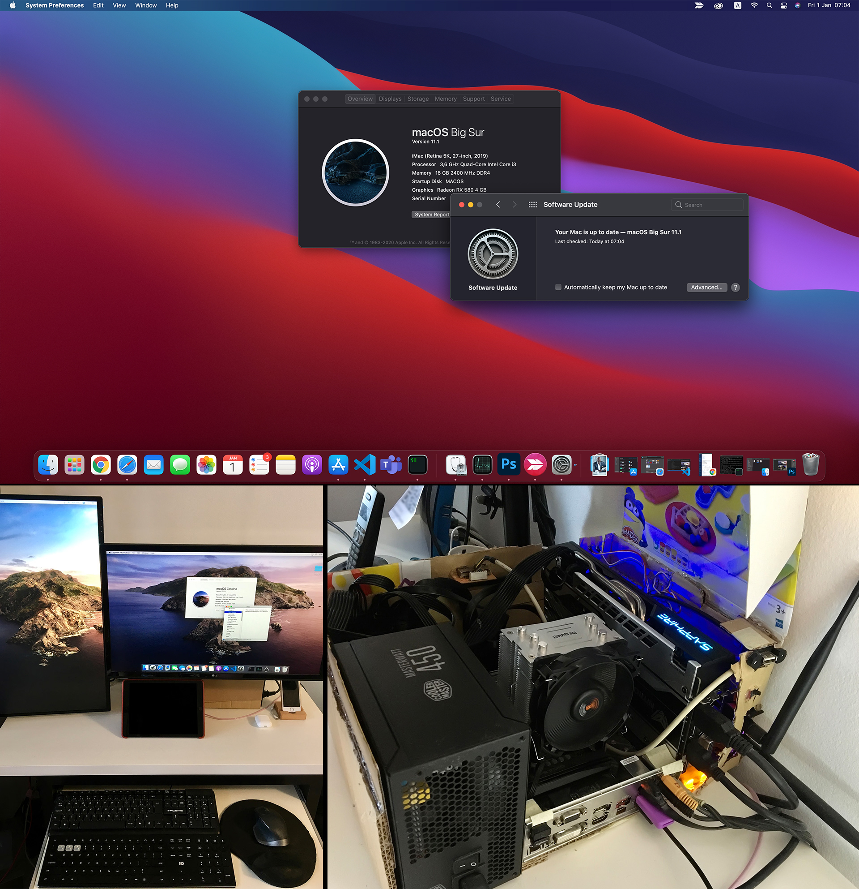

# Hackintosh-Catalina-Gigabyte-B360M-D3H-i3-8100-RX580-BCM943602CS-4K-monitor-OpenCore

## *NOTE: This is a work in progress*



## Versions
- macOS Big Sur 11.1 (*updated*)
- OpenCore 0.6.4 (*updated*)

## What's working
||Status|Additional details|
|:-|:-|:-|
|Sound| :ok_hand: ||
|USB Ports| :ok_hand: |6 x USB 2.0; 4 x USB 3.0: I didn't perform any speed test on the USB 3.1 port|
|WiFi| :ok_hand: ||
|Bluetooth| :ok_hand: ||
|Airdrop/Handoff| :ok_hand: ||
|Ethernet| :ok_hand: ||
|Unlock with Apple Watch| :ok_hand: ||
|Airdrop/Handoff| :ok_hand: ||
|Graphics acceleration (dGPU)| :ok_hand: :grey_exclamation: |Connected to two monitors through DisplayPort and HDMI. I didn't compare the performance|
|Sidecar| :thumbsdown: |iPad shows a black screen|
|Restart/Shutdown| :ok_hand: ||
|Sleep| :ok_hand: ||
|CPU power management| :question: |Not tested|
|iServices| :ok_hand: ||
|DRM| :thumbsup: :grey_exclamation: | Apple TV works well but the mouse cursor disappears. Netflix starts to play but after some seconds the video turns black|


## Complete hardware description
- Gigabyte B360M D3H
- Intel i3-8100 @3.60GHz
- Sapphire Radeon RX 580 Nitro+
- 4x4GB DDR4 2400MHz
- Wifi and Bluetooth card (PCI-express 1x adapter BCM943602CS)
- Dual monitor setup:
  - 4K monitor (DisplayPort)
  - 1080p vertical monitor (HDMI)
- Dual boot system
  - 500GB NVME SSD for Windows/Linux
  - 500GB SDD only for MacOS


## Dual boot
Because I mainly use Windows and Linux (for professional reasons) I didn't need a quick dual boot setup. So I use a cheap SSD for macOS. When I want to boot on macOS, I press F12 to select the BIOS startup disk.

## Material required
- *16GB USB Flash Drive* The new macOS Catalina doesn't fit anymore on a 8GB flash drive, because I had problems on the past with my USB 3.0 flash drive, I use an old USB 2.0 flash drive to hackintosh

## Instructions
Follow the guide https://dortania.github.io/OpenCore-Desktop-Guide/

## EFI Folder
```
├───BOOT
│       BOOTx64.efi
│       
└───OC
    │   config.plist
    │   OpenCore.efi
    │   
    ├───ACPI
    │       SSDT-AWAC.aml
    │       SSDT-EC.aml
    │       SSDT-PLUG.aml
    │       SSDT-PMC.aml
    │       SSDT-SBUS-MCHC.aml
    │       SSDT-USBX.aml
    │       
    ├───Bootstrap
    │       Bootstrap.efi
    │       
    ├───Drivers
    │       AudioDxe.efi
    │       CrScreenshotDxe.efi
    │       HfsPlus.efi
    │       OpenRuntime.efi
    │       
    ├───Kexts
    │   ├───AppleALC.kext
    │   │   └───Contents
    │   │       │   Info.plist
    │   │       │   
    │   │       └───MacOS
    │   │               AppleALC
    │   │               
    │   ├───IntelMausi.kext
    │   │   └───Contents
    │   │       │   Info.plist
    │   │       │   
    │   │       └───MacOS
    │   │               IntelMausi
    │   │               
    │   ├───Lilu.kext
    │   │   └───Contents
    │   │       │   Info.plist
    │   │       │   
    │   │       └───MacOS
    │   │               Lilu
    │   │               
    │   ├───SMCProcessor.kext
    │   │   └───Contents
    │   │       │   Info.plist
    │   │       │   
    │   │       └───MacOS
    │   │               SMCProcessor
    │   │               
    │   ├───SMCSuperIO.kext
    │   │   └───Contents
    │   │       │   Info.plist
    │   │       │   
    │   │       └───MacOS
    │   │               SMCSuperIO
    │   │               
    │   ├───USBInjectAll.kext
    │   │   └───Contents
    │   │       │   Info.plist
    │   │       │   
    │   │       ├───MacOS
    │   │       │       USBInjectAll
    │   │       │       
    │   │       └───_CodeSignature
    │   │               CodeResources
    │   │               
    │   ├───VirtualSMC.kext
    │   │   └───Contents
    │   │       │   Info.plist
    │   │       │   
    │   │       └───MacOS
    │   │               VirtualSMC
    │   │               
    │   ├───WhateverGreen.kext
    │   │   └───Contents
    │   │       │   Info.plist
    │   │       │   
    │   │       └───MacOS
    │   │               WhateverGreen
    │   │               
    │   └───XHCI-unsupported.kext
    │       └───Contents
    │               Info.plist
    │               
    ├───Resources
    │   ├───Audio
    │   ├───Font
    │   ├───Image
    │   └───Label
    └───Tools
            OpenShell.efi
```

### Bios Settings
[Check this file](BIOS.md)

### OpenCore 0.5.9 to 0.6.0 update
- Backup your EFI folder on a USB flash drive
- Follow the instructions on the official guide: https://dortania.github.io/OpenCore-Post-Install/universal/update.html#updating-opencore
- Compare the config.plist with the sample.plist and configure it accordingly. Note that you need to remove the `BlacklistAppleUpdate` key because it's deprecated and it trigger a warning
- Reboot and check for the system stability

### macOS 10.15.6 update
- Update OpenCore to the latest version
- Update macOS
- The system will start the update and it will restart automatically (wait a few minutes)
- When the system restarts, choose on the OpenCore boot manager the new option to Install macOS
- The update can take more than 15 minutes
- The system will reboot automatically and then boot normally on the OpenCore boot manager
- After a longer boot process, you will be asked to introduce your iCloud password and then you can log in normally
- Restart the system to check for any problems on the boot loader
- Done (it was easier than I thought)!

## Credits
- https://github.com/acidanthera/OpenCorePkg
- https://www.reddit.com/r/hackintosh/

